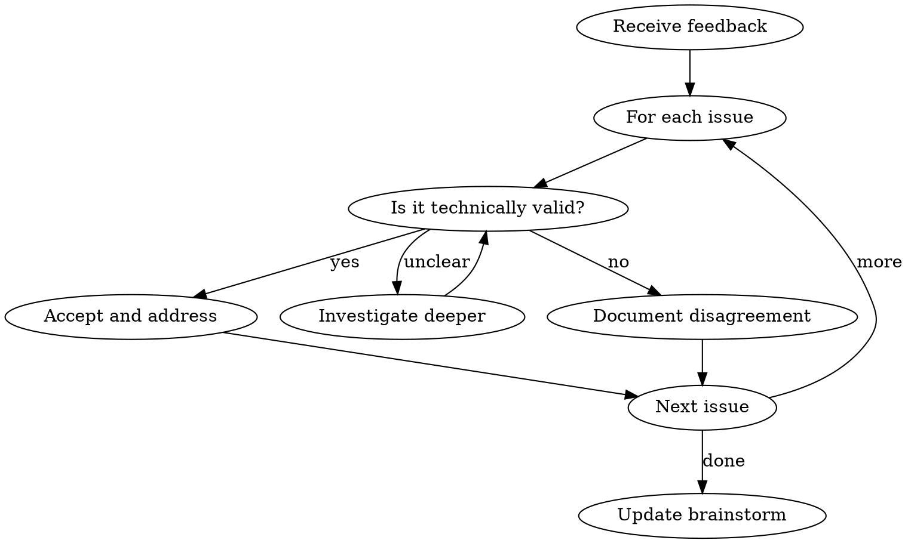

# Vrau Workflow v2 Implementation Plan

> **For Claude:** REQUIRED SUB-SKILL: Use superpowers:executing-plans to implement this plan task-by-task.

**Goal:** Redesign vrau workflow with two-phase architecture, issue tracking, model selection per step, and commit discipline.

**Architecture:** Replace `.claude/vrau/workflows/` with `docs/designs/` structure. Add README template system. Create new skills for receiving review feedback. Update all commands for new flow.

**Tech Stack:** Markdown skills, GitHub CLI (gh), git

---

## Task Dependencies

```
Task 1 (gitignore) ─────────────────────────────────────────────┐
Task 2 (template) ──────────────────────────────────────────────┤
Task 3 (find-workflow) ─────────────────────────────────────────┼─> Task 8 (start.md)
Task 4 (receiving-brainstorm-review) ───> Task 6 (brainstorm) ──┤
Task 5 (receiving-plan-review) ─────────> Task 7 (plan.md) ─────┤
                                          Task 9 (execute.md) ──┘
```

Tasks 1-5 can run in parallel. Tasks 6-7 depend on 4-5. Task 8 depends on 1-3, 6-7. Task 9 depends on 8.

---

## Task 1: Update Gitignore Patterns

**Files:**
- Modify: `/Users/mguilarducci/Projects/mguilarducci/vrau/.gitignore`

**Step 1: Read current gitignore**

```bash
cat .gitignore
```

**Step 2: Add new patterns**

Add these patterns if not present:
```
# Vrau local-only workflow files
docs/designs/**/.no-commit.local
docs/designs/**/*.local.md
.claude/vrau/**/*.local.*
```

**Step 3: Commit**

```bash
git add .gitignore
git commit -m "chore: add gitignore patterns for vrau local-only mode"
```

---

## Task 2: Create README Template

**Files:**
- Create: `/Users/mguilarducci/Projects/mguilarducci/vrau/.claude/vrau/templates/README.template.md`

**Step 1: Create templates directory**

```bash
mkdir -p .claude/vrau/templates
```

**Step 2: Write template file**

```markdown
# {{TASK_TITLE}}

**Task:** {{TASK_DESCRIPTION}}

**Branch:** {{BRANCH_NAME}}
**Date:** {{DATE}}
**Doc Approach:** {{DOC_APPROACH}}

## User Choices

| Setting | Value |
|---------|-------|
| Doc location | `docs/designs/{{FOLDER_NAME}}/` |
| Issue platform | {{ISSUE_PLATFORM}} |
| No-commit mode | {{NO_COMMIT_MODE}} |

## Model Configuration

| Step | Model |
|------|-------|
| Branch setup | {{MODEL_BRANCH_SETUP}} |
| Instructions | {{MODEL_INSTRUCTIONS}} |
| Verifications | {{MODEL_VERIFICATIONS}} |
| Brainstorm | {{MODEL_BRAINSTORM}} |
| Brainstorm review | {{MODEL_BRAINSTORM_REVIEW}} |
| Breakdown | {{MODEL_BREAKDOWN}} |
| Pre-plan | {{MODEL_PRE_PLAN}} |
| Write plan | {{MODEL_WRITE_PLAN}} |
| Plan review | {{MODEL_PLAN_REVIEW}} |
| Execute simple | {{MODEL_EXECUTE_SIMPLE}} |
| Execute complex | {{MODEL_EXECUTE_COMPLEX}} |
| Execute very complex | {{MODEL_EXECUTE_VERY_COMPLEX}} |
| Quality/review | {{MODEL_QUALITY_REVIEW}} |

## Links

### Design Documents
{{DESIGN_LINKS}}

### Plan Documents
{{PLAN_LINKS}}

### GitHub Issues
{{ISSUE_LINKS}}
```

**Step 3: Commit**

```bash
git add .claude/vrau/templates/README.template.md
git commit -m "feat(vrau): add README template for workflow folders"
```

---

## Task 3: Update find-workflow Skill for New Paths

**Files:**
- Modify: `/Users/mguilarducci/Projects/mguilarducci/vrau/skills/find-workflow/SKILL.md`

**Step 1: Read current skill**

```bash
cat skills/find-workflow/SKILL.md
```

**Step 2: Update paths and state derivation**

Change from `.claude/vrau/workflows/` to `docs/designs/`.

Update state derivation to check for:
- `design/` folder with files → brainstorm_complete
- `plan/` folder with files → plan_complete
- README.md with execution log reference → executing

**Step 3: Write updated skill**

```markdown
---
name: find-workflow
description: Use when needing to discover, list, or select an existing vrau workflow from docs/designs/. Use before any command that operates on an existing workflow.
---

# Find Workflow

## Overview

Discovers vrau workflows and handles user selection. Returns workflow path, name, state, and files.

## When to Use

- Before operating on an existing workflow
- When user runs /vrau:brainstorm, /vrau:plan, /vrau:execute, /vrau:abort, /vrau:status
- When resuming work after session ends

## Process

1. Scan `docs/designs/` for folders matching pattern `YYYY-MM-DD-*`
2. If none exist → display "No workflows found. Use /vrau:start to begin."
3. If one exists → auto-select it
4. If multiple exist → present numbered list with state, ask user to choose

## State Derivation

Derive state from folder contents:

| Folder Contents | State |
|-----------------|-------|
| README.md only | not_started |
| README.md + design/*.md | brainstorm_complete |
| README.md + design/*.md + plan/*.md | plan_complete |
| README.md with "Execution complete" | done |

## Output Format

After selection, provide:
- **Path:** `docs/designs/<workflow-name>/`
- **Name:** `<workflow-name>`
- **State:** One of the states above
- **Files:** List of files present
- **Doc Approach:** A (files), B (issues), or C (local-only)
- **No-Commit Mode:** true/false (check for .no-commit.local file)

## Display Format (for multiple workflows)

```
Found workflows:

1. 2026-01-10-feat-add-auth
   State: plan_complete
   Files: design/auth-design.md, plan/auth-plan.md

2. 2026-01-12-fix-api-error
   State: brainstorm_complete
   Files: design/api-error-design.md

Which workflow? [1-2]
```

## No-Commit Mode Detection

Check for `.no-commit.local` file in workflow folder. If present:
- Set `no_commit_mode: true`
- Display warning: "This workflow is in NO-COMMIT mode. Files will NOT be committed."
```

**Step 4: Commit**

```bash
git add skills/find-workflow/SKILL.md
git commit -m "refactor(vrau): update find-workflow for docs/designs/ paths"
```

---

## Task 4: Create receiving-brainstorm-review Skill (TDD)

**Files:**
- Create: `/Users/mguilarducci/Projects/mguilarducci/vrau/skills/receiving-brainstorm-review/SKILL.md`

**IMPORTANT:** Follow TDD for skills - RED (baseline) → GREEN (write skill) → REFACTOR (close loopholes)

**Step 1: RED - Document baseline behavior**

Run a test scenario WITHOUT the skill to see how Claude naturally handles brainstorm review feedback. Document:
- What rationalizations does it use?
- Does it blindly agree with reviewer?
- Does it push back appropriately?

**Step 2: GREEN - Write minimal skill**

Based on baseline failures, write skill that addresses those specific issues:

```markdown
---
name: receiving-brainstorm-review
description: Use when receiving reviewer feedback on brainstorm/design documents. Requires technical rigor and verification, not blind agreement or defensive rejection.
---

# Receiving Brainstorm Review

## Overview

Handle reviewer feedback on brainstorm documents with intellectual rigor. Neither blindly accept nor defensively reject - verify each point technically.

## When to Use

- After vrau-reviewer returns feedback on a brainstorm
- When reviewer suggests REVISE or RETHINK
- When iterating on design based on review

## Core Principle

**Reviewer feedback is data, not commands.** Evaluate each point on technical merit.

## Process



## Response Framework

For EACH reviewer point:

1. **Acknowledge**: State the concern clearly
2. **Verify**: Check if technically valid in this context
3. **Decide**: Accept, partially accept, or respectfully disagree
4. **Act**: Make changes or document reasoning

## Red Flags - You're Doing It Wrong

- Accepting all suggestions without verification
- Saying "great point" before checking if it's actually valid
- Defensive rejection without technical reasoning
- Making changes just to appease reviewer
- Ignoring complexity calibration (over-engineering simple tasks)

## Complexity Calibration

Remember the task complexity. Don't accept suggestions that would over-engineer:
- **Trivial task**: Reject demands for extensive error handling
- **Simple task**: Reject enterprise patterns for a CLI tool
- **Complex task**: Accept thorough security/resilience suggestions

## Output Format

After processing feedback:

```markdown
## Review Response

### Accepted Changes
- [Issue]: [Why it's valid] → [Change made]

### Partial Acceptance
- [Issue]: [Valid part] vs [Invalid part] → [Compromise]

### Respectful Disagreement
- [Issue]: [Why we disagree] → [Our reasoning]

## Updated Brainstorm Summary
[Brief description of changes made]
```
```

**Step 3: REFACTOR - Test and close loopholes**

Run test scenarios WITH skill. Document new rationalizations. Add counters.

**Step 4: Commit**

```bash
git add skills/receiving-brainstorm-review/SKILL.md
git commit -m "feat(vrau): add receiving-brainstorm-review skill"
```

---

## Task 5: Create receiving-plan-review Skill (TDD)

**Files:**
- Create: `/Users/mguilarducci/Projects/mguilarducci/vrau/skills/receiving-plan-review/SKILL.md`

**Step 1: RED - Document baseline behavior**

Same as Task 4 but for plan reviews.

**Step 2: GREEN - Write minimal skill**

```markdown
---
name: receiving-plan-review
description: Use when receiving reviewer feedback on implementation plans. Requires technical verification of feasibility concerns, not blind agreement.
---

# Receiving Plan Review

## Overview

Handle reviewer feedback on implementation plans with technical rigor. Plans have different concerns than brainstorms: feasibility, ordering, dependencies, completeness.

## When to Use

- After vrau-reviewer returns feedback on a plan
- When reviewer suggests REVISE or RETHINK
- When iterating on plan based on review

## Core Principle

**Plans are promises. Review feedback questions if promises are keepable.**

## Plan-Specific Concerns

Unlike brainstorm reviews, plan reviews focus on:
- Task ordering and dependencies
- Missing steps
- Unrealistic scope per task
- Test coverage gaps
- Integration points

## Process

Same as receiving-brainstorm-review but with plan-specific lens:

1. **Acknowledge**: State the concern
2. **Verify**: Check if concern is valid for THIS plan
3. **Decide**: Accept, partially accept, or disagree
4. **Act**: Update plan or document reasoning

## Red Flags - You're Doing It Wrong

- Accepting scope expansion without questioning necessity
- Adding tasks "just in case"
- Ignoring dependency concerns
- Defensive about task ordering
- Not verifying if suggested tests are actually needed

## Output Format

```markdown
## Plan Review Response

### Accepted Changes
- [Issue]: [Why valid] → [Plan change]

### Partial Acceptance
- [Issue]: [Valid part] → [Compromise]

### Respectful Disagreement
- [Issue]: [Why we disagree]

## Updated Plan Summary
- Tasks added: N
- Tasks modified: N
- Tasks removed: N
- Dependencies changed: Y/N
```
```

**Step 3: REFACTOR - Test and close loopholes**

**Step 4: Commit**

```bash
git add skills/receiving-plan-review/SKILL.md
git commit -m "feat(vrau): add receiving-plan-review skill"
```

---

## Task 6: Rewrite _phases/brainstorm.md

**Files:**
- Modify: `/Users/mguilarducci/Projects/mguilarducci/vrau/commands/_phases/brainstorm.md`

**Dependencies:** Task 4 (receiving-brainstorm-review skill)

**Step 1: Read current file**

```bash
cat commands/_phases/brainstorm.md
```

**Step 2: Write new content**

```markdown
# Phase 1: Brainstorm

## Pre-Brainstorm Checks (haiku)

Before brainstorming, run verification checks:
- Run tests: `npm test` or equivalent
- Check dev server: `npm run dev` or equivalent
- Document any existing issues

## Invoke Brainstorming (opus)

Use `superpowers:brainstorming` skill with opus model.

Let the skill drive the conversation until producing a final brainstorm document.

**Completion signal:** Summary or "brainstorm complete" message.

## Save and Commit Discipline

**CRITICAL:** Save progress frequently to enable stateless recovery.

After each major Q&A section:
1. Save to appropriate location based on doc approach:
   - **Option A/C:** `docs/designs/<workflow>/design/<name>.md`
   - **Option B:** Update GitHub Issue
2. If NOT in no-commit mode:
   ```bash
   git add docs/designs/<workflow>/
   git commit -m "design: <description> [#issue-number]"
   git push
   ```

## Review Loop (opus)

**FIRST: Recommend session compaction**

Tell user: "Consider compacting the session before review to free up context."

### Review Process

1. Ensure all content is saved and committed
2. Spawn reviewer with Task tool:
   ```
   subagent_type: "vrau:vrau-reviewer"
   prompt:
     1. Task: <one-line description>
     2. Complexity: <trivial|simple|moderate|complex>
     3. Content: <brainstorm.md content>
     4. Request: "Review this brainstorm"
   ```

3. If reviewer returns REVISE or RETHINK:
   - **REQUIRED SKILL:** Use `vrau:receiving-brainstorm-review`
   - Process each issue with technical rigor
   - Update document
   - Save, commit, push (unless no-commit)
   - Re-invoke reviewer

4. Loop constraints:
   - Max 3 iterations automatically
   - After 3: Ask user "Reviewer still has concerns: [list]. Continue reviewing?"

## Breakdown Attempt (sonnet)

**FIRST: Recommend session compaction**

### Analyze for Decomposition

Check if design can be broken into smaller independent designs:
- Each piece should be feature/value-sized
- If already small enough, skip breakdown

### If Breaking Down

**For file-based (Option A/C):**
```
docs/designs/<workflow>/design/
  00-executive-summary.md    # High-level only
  01-design-<feature-x>.md   # First sub-design
  02-design-<feature-y>.md   # Second sub-design
```
- Main file becomes executive summary
- Each sub-design references main
- Update README.md
- Commit and push (unless no-commit)

**For issue-based (Option B):**
- Main issue becomes executive summary
- Create sub-issues with `gh issue create`
- Set parent relationship: `gh issue edit <sub> --add-parent <main>`
- Update README.md with issue links
- Commit and push

### Sub-Design Review

**Ask user:** "Should I review each sub-design individually?"
- If yes: Run review loop on each
- If no: Proceed to PR

## Open PR (sonnet)

1. Invoke `superpowers:finishing-a-development-branch`
2. Open PR with design summary
3. Merge PR

**Do NOT wait for user choice on PR - just open and merge.**
```

**Step 3: Commit**

```bash
git add commands/_phases/brainstorm.md
git commit -m "refactor(vrau): rewrite brainstorm phase with commit discipline"
```

---

## Task 7: Rewrite _phases/plan.md

**Files:**
- Modify: `/Users/mguilarducci/Projects/mguilarducci/vrau/commands/_phases/plan.md`

**Dependencies:** Task 5 (receiving-plan-review skill)

**Step 1: Read current file**

**Step 2: Write new content**

```markdown
# Phase 2: Plan

**Important:** Plans always go to files, NOT issues. Do not update GitHub Issues with plan content.

## Pre-Plan Setup (haiku)

**Recommend new session:** "Consider starting a fresh session for planning."

### Select Design to Plan

Ask which design to plan (file names only, don't read content):

```
Which design do you want to plan?

Files in docs/designs/<workflow>/design/:
1. 01-design-feature-x.md
2. 02-design-feature-y.md

Or issues in README.md:
3. #123 - Feature X

Select: [1-N]
```

### Branch Setup

Same as Phase 1 Step 0:
1. Update default branch: `git fetch origin && git checkout main && git pull`
2. Branch/worktree selection (use superpowers:using-git-worktrees if worktree)
3. Push new branch: `git push -u origin <branch>`

## Write Plan (opus)

1. Invoke `superpowers:writing-plans` skill with opus model
2. Provide context: reference the selected design document
3. Write plan to: `docs/designs/<workflow>/plan/<design-name>-plan.md`

**Commit discipline:** Commit after each major section:
```bash
git add docs/designs/<workflow>/plan/
git commit -m "plan: <description> [#issue-number]"
git push
```

**Plan requirements:**
- List all task dependencies explicitly
- Reference the design document
- Follow bite-sized task format from writing-plans skill

## Review Loop (opus)

**FIRST: Recommend session compaction**

### Review Process

1. Ensure plan is saved and committed
2. Spawn reviewer:
   ```
   subagent_type: "vrau:vrau-reviewer"
   prompt:
     1. Task: <one-line description>
     2. Complexity: <same as brainstorm>
     3. Content: <plan.md content>
     4. Request: "Review this plan for completeness and feasibility"
   ```

3. If reviewer returns REVISE or RETHINK:
   - **REQUIRED SKILL:** Use `vrau:receiving-plan-review`
   - Process each issue with technical rigor
   - Update plan
   - Save, commit, push
   - Re-invoke reviewer

4. Loop constraints: Max 3 iterations, then ask user

## Proceed to Execution

When plan is approved, proceed to Phase 3 (Execute).
```

**Step 3: Commit**

```bash
git add commands/_phases/plan.md
git commit -m "refactor(vrau): rewrite plan phase with dependency tracking"
```

---

## Task 8: Rewrite commands/start.md

**Files:**
- Modify: `/Users/mguilarducci/Projects/mguilarducci/vrau/commands/start.md`

**Dependencies:** Tasks 1-3, 6-7

**Step 1: Read current file**

**Step 2: Write complete new start command**

This is the main orchestration file. It needs to cover:
- Step 0: Branch setup
- Step 1: Doc approach selection + model selection
- Then delegate to phases

```markdown
---
description: "Begin a new vrau workflow"
---

# Start Vrau Workflow

## Step 0: Branch Setup (haiku)

### 0.1 Update Default Branch

```bash
git fetch origin
git checkout main
git pull origin main
```

### 0.2 Branch/Worktree Selection

```
How do you want to work?

1. Create worktree (isolated workspace)
   → Uses superpowers:using-git-worktrees
   → Best for: larger features, parallel work

2. Work in current branch
   → Stay in current directory
   → Best for: continuing existing work

3. Create new branch (no worktree)
   → git checkout -b <branch-name>
   → Best for: standard git flow
```

Based on choice:
- **Option 1**: Invoke `superpowers:using-git-worktrees` with branch name
- **Option 2**: No git operations needed
- **Option 3**: Run `git checkout -b <branch-name>`

### 0.3 Push New Branch

```bash
git push -u origin <branch-name>
```

---

## Step 1: Configuration (haiku)

### 1.1 Get Task Description

```
What are you working on?
> [Wait for user to describe task]
```

### 1.2 Generate Branch Name

Generate suggested branch name from task:
- Use kebab-case
- Prefix with fix/, feat/, refactor/, etc.
- Replace slashes with dashes for folder naming

```
Suggested branch: <generated-name>

1. Confirm
2. Edit name
```

Branch names must match: `^[a-zA-Z0-9/_-]+$`

### 1.3 Document Approach Selection

```
How should I store design documents?

A. File-based (default)
   → docs/designs/{date}-{branch}/design/{file}.md
   → Committed and pushed

B. GitHub Issues
   → Create issues for design documentation
   → Save links to docs/designs/{date}-{branch}/README.md

C. Local-only (NO COMMITS)
   → Same as A, but NEVER commit design files
   → Creates .no-commit.local marker
```

**Folder naming:** Replace `/` with `-` in branch name

**After selection:**
- Record choice in README.md
- If option C: Create `.no-commit.local` file (gitignored)

### 1.4 Model Selection

Show default models:

```
Model configuration (defaults shown):

Phase 1 - Brainstorm:
  - Branch setup: haiku
  - Instructions: haiku
  - Verifications: haiku
  - Brainstorm: opus
  - Review: opus
  - Breakdown: sonnet

Phase 2 - Plan:
  - Pre-plan: haiku
  - Write plan: opus
  - Plan review: opus

Phase 3 - Execute:
  - Simple code: haiku
  - Complex code: sonnet
  - Very complex: opus (will ask first)
  - Quality/review: sonnet (minimum)

Accept defaults? [Y/n] or specify changes
```

**Model override policy:** Locked at start. User can request change mid-flow, but only if they explicitly ask.

### 1.5 Create Workflow Folder

```bash
WORKFLOW=$(date +%Y-%m-%d)-<branch-name-with-dashes>
mkdir -p docs/designs/$WORKFLOW/design
mkdir -p docs/designs/$WORKFLOW/plan
```

### 1.6 Create README from Template

Copy `.claude/vrau/templates/README.template.md` to `docs/designs/$WORKFLOW/README.md`

Fill in template variables:
- {{TASK_TITLE}}: From task description
- {{TASK_DESCRIPTION}}: Full description
- {{BRANCH_NAME}}: Actual branch name
- {{DATE}}: Today's date
- {{DOC_APPROACH}}: A, B, or C
- {{FOLDER_NAME}}: Workflow folder name
- {{NO_COMMIT_MODE}}: true/false
- All model selections

### 1.7 Initial Commit

If NOT in no-commit mode:
```bash
git add docs/designs/$WORKFLOW/README.md
git commit -m "chore: initialize vrau workflow for <task>"
git push
```

---

## Phase 1: Brainstorm

Read [_phases/brainstorm.md](_phases/brainstorm.md) for the complete brainstorm process.

---

## Phase 2: Plan

Read [_phases/plan.md](_phases/plan.md) for the complete planning process.

---

## Phase 3: Execute

Read [_phases/execute.md](_phases/execute.md) for execution options.

---

## State Recovery

| Folder Contents | State | Resume with |
|-----------------|-------|-------------|
| README.md only | Not started | `/vrau:brainstorm` |
| README.md + design/*.md | Brainstorm done | `/vrau:plan` |
| + plan/*.md | Plan done | `/vrau:execute` |
| Execution complete in README | Done | `/vrau:status` |
```

**Step 3: Commit**

```bash
git add commands/start.md
git commit -m "refactor(vrau): complete rewrite of start command for v2"
```

---

## Task 9: Rewrite _phases/execute.md

**Files:**
- Modify: `/Users/mguilarducci/Projects/mguilarducci/vrau/commands/_phases/execute.md`

**Dependencies:** Task 8

**Step 1: Write new content**

```markdown
# Phase 3: Execute

**FIRST: Recommend session compaction**

Tell user: "Consider compacting or starting a fresh session for execution."

## Pre-Execution Checks (sonnet)

### Verify Dependencies

Check if all dependencies listed in plan file are implemented:

```
Checking plan dependencies...

Dependencies found:
- [ ] Task 1 depends on: (none)
- [ ] Task 3 depends on: Task 1, Task 2
- [ ] Task 5 depends on: Task 3

Missing implementations: [list any missing]
```

If dependencies missing, notify user before proceeding.

### Ask Permission

```
Plan approved. Ready to execute.

Proceed with execution? [Y/n]
```

## Execution (model varies)

### Model Selection Rules

Based on task complexity (from README.md config):
- **Simple tasks**: haiku
- **Complex tasks**: sonnet
- **Very complex tasks**: **ASK** before using opus
- **Quality/review**: sonnet minimum (never haiku)

### Execution Process

1. Invoke `superpowers:subagent-driven-development`
2. After permission granted:
   - Execute without asking for each step
   - Ask only if doubts or decisions needed
3. Follow superpower skill until complete

## Post-Execution

### Update README

Add execution summary to README.md:
```markdown
## Execution Log

**Completed:** YYYY-MM-DD
**Tasks completed:** N/N
**Notes:** [Any relevant notes]
```

### Open PR

1. Open PR with `gh pr create`
2. Add comment: `@claude, review`

```bash
gh pr create --title "<task description>" --body "## Summary
- Implements design from docs/designs/<workflow>/
- Plan: docs/designs/<workflow>/plan/<plan>.md

## Test Plan
- [x] All tests pass
- [x] Manual verification complete"

gh pr comment <pr-number> --body "@claude, review"
```
```

**Step 2: Commit**

```bash
git add commands/_phases/execute.md
git commit -m "refactor(vrau): rewrite execute phase with model selection"
```

---

## Task 10: Update README.md with Design Links

**Files:**
- Modify: `/Users/mguilarducci/Projects/mguilarducci/vrau/docs/designs/2026-01-16-vrau-workflow-v2/README.md`

**Step 1: Update links section**

Add references to design and plan files created during this workflow.

**Step 2: Commit**

```bash
git add docs/designs/2026-01-16-vrau-workflow-v2/
git commit -m "docs: update vrau v2 workflow README with links"
```

---

## Task 11: Final Integration Test

**No files to modify - verification only**

**Step 1: Test /vrau:start flow**

Run through the start flow manually:
1. Invoke /vrau:start
2. Verify branch setup options work
3. Verify doc approach selection works
4. Verify model selection display works
5. Verify README template is filled correctly
6. Verify folder structure is created

**Step 2: Test find-workflow**

1. Verify it finds workflows in docs/designs/
2. Verify state derivation works
3. Verify no-commit mode detection works

**Step 3: Document any issues**

If issues found, create follow-up tasks.

---

## Summary

| Task | Description | Dependencies |
|------|-------------|--------------|
| 1 | Update gitignore | None |
| 2 | Create README template | None |
| 3 | Update find-workflow skill | None |
| 4 | Create receiving-brainstorm-review (TDD) | None |
| 5 | Create receiving-plan-review (TDD) | None |
| 6 | Rewrite brainstorm phase | Task 4 |
| 7 | Rewrite plan phase | Task 5 |
| 8 | Rewrite start command | Tasks 1-3, 6-7 |
| 9 | Rewrite execute phase | Task 8 |
| 10 | Update workflow README | Task 9 |
| 11 | Integration test | Task 10 |
