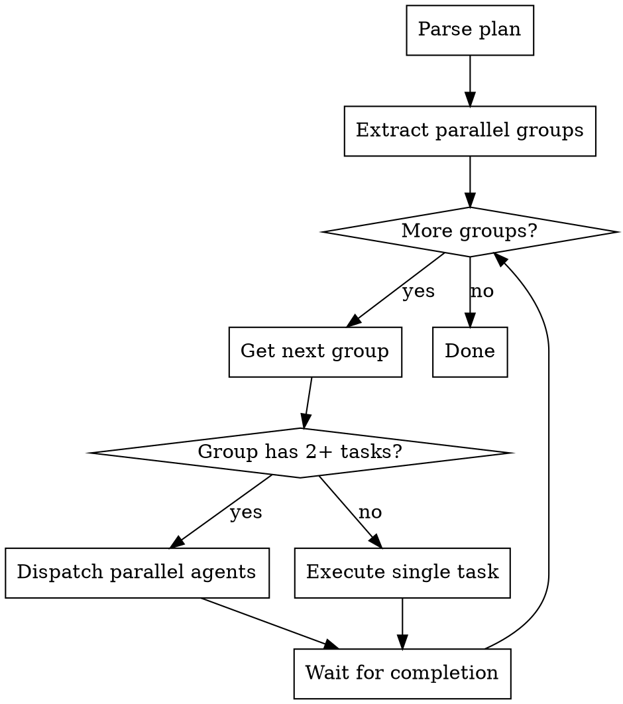

# Enhanced Plan Execution Implementation Plan

> **For Claude:** REQUIRED SUB-SKILL: Use vrau:execute-phase to implement this plan task-by-task.

**Goal:** Add dependency-aware parallel execution, per-task model recommendations, and research integration to vrau workflow.

**Architecture:** Create two new vrau skills (vrau-writing-plans, vrau-executing-plans) that wrap superpowers skills with enhanced features. Modify five existing skills to add research steps and use the new skills.

**Tech Stack:** Claude Code skills (markdown), Task tool with parallel dispatch, MCP tools integration

---

## Task Dependency Graph

```
Task 0 (vrau-writing-plans) ──┬──► Task 2 (plan-phase) ────────────────┐
                              │                                         │
Task 1 (vrau-executing-plans) ┴──► Task 3 (execute-phase) ──────────────┤
                                                                        │
Task 4 (brainstorm-phase) ─────────────────────────────────────────────┤
                                                                        │
Task 5 (receiving-brainstorm-review) ──────────────────────────────────┤
                                                                        │
Task 6 (receiving-plan-review) ────────────────────────────────────────┤
                                                                        │
                                                                        ▼
                                                              Task 7 (README)
```

## Parallel Execution Groups

| Group | Tasks | Can Start After |
|-------|-------|-----------------|
| A | 0, 1, 4, 5, 6 | (none) - all independent |
| B | 2, 3 | Tasks 0, 1 complete |
| C | 7 | All previous complete |

## Model Assignments

| Task | Model | Rationale |
|------|-------|-----------|
| 0 | sonnet | New skill creation, moderate complexity |
| 1 | sonnet | New skill creation, moderate complexity |
| 2 | haiku | Simple modification |
| 3 | haiku | Simple modification |
| 4 | haiku | Adding one section |
| 5 | haiku | Adding one section |
| 6 | haiku | Adding one section |
| 7 | haiku | Documentation update |

---

### Task 0: Create vrau-writing-plans Skill

**Depends on:** (none)
**Parallel group:** A
**Model:** sonnet

**Files:**
- Create: `skills/vrau-writing-plans/SKILL.md`

**Step 1: Create skill directory**

```bash
mkdir -p /Users/matheus/Projects/mguilarducci/vrau/skills/vrau-writing-plans
```

**Step 2: Write skill content**

Create `skills/vrau-writing-plans/SKILL.md` with:

```markdown
---
name: vrau-writing-plans
description: Use when writing implementation plans in vrau workflow - adds dependency graphs, parallel groups, and model assignments to plans
---

# Vrau Writing Plans

Enhanced plan writing that adds dependency tracking, parallel execution groups, and per-task model recommendations.

## Overview

Wraps `superpowers:writing-plans` with vrau-specific enhancements:
- Task dependency graph (visual + per-task)
- Parallel execution groups
- Model assignment per task

**Announce at start:** "I'm using vrau-writing-plans to create the implementation plan with dependency tracking."

## Step 0: Research Available Tools (haiku)

Before writing the plan, check what research tools are available:

1. **List available MCP tools** - documentation fetchers, web search, API explorers
2. **Identify relevant tools** - does the task mention technologies that have MCP tools?
3. **Use relevant tools** - fetch current docs, search for patterns, gather context

**Output:** Brief summary of research findings to inform the plan.

## Plan Format Requirements

Every plan MUST include these sections after the header:

### 1. Task Dependency Graph

Visual ASCII representation of task dependencies:

```
Task 0 ──┬──► Task 2 ──► Task 4
         │
Task 1 ──┘
```

### 2. Parallel Execution Groups

| Group | Tasks | Can Start After |
|-------|-------|-----------------|
| A | 0, 1 | (none) |
| B | 2 | Group A complete |
| C | 3, 4 | Task 2 complete |

### 3. Model Assignments

| Task | Model | Rationale |
|------|-------|-----------|
| 0 | haiku | Simple setup |
| 1 | sonnet | Complex logic |

### 4. Per-Task Format

Each task MUST include:

```markdown
### Task N: [Name]

**Depends on:** Task X, Task Y (or "none")
**Parallel group:** A
**Model:** haiku/sonnet/opus

**Files:**
...

**Steps:**
...
```

## Model Selection Rules

Apply vrau model conventions:

| Complexity | Model | Examples |
|------------|-------|----------|
| trivial | haiku | Setup, config, simple edits |
| simple | haiku | Single file changes, basic tests |
| moderate | sonnet | Multi-file changes, integration |
| complex | sonnet | Architecture, security-sensitive |
| very complex | opus | Requires explicit user approval |

**Quality/review work:** sonnet minimum (never haiku)

## Dependency Analysis

When creating tasks:

1. **Identify true dependencies** - Task B needs output from Task A
2. **Avoid false dependencies** - preference-based ordering is not a dependency
3. **Maximize parallelism** - independent tasks go in same parallel group
4. **Prevent conflicts** - parallel tasks must not edit same files

## After Writing Plan

Call `superpowers:writing-plans` for the standard task format, then add:
- Dependency graph section
- Parallel groups table
- Model assignments table
- Per-task dependency/group/model fields

## Execution Handoff

After plan is complete:

> "Plan complete with N tasks in M parallel groups. Ready for execution?"

When executing, use `vrau:execute-phase` which understands the parallel group format.
```

**Step 3: Commit**

```bash
git add skills/vrau-writing-plans/
git commit -m "feat(vrau): add vrau-writing-plans skill with dependency tracking"
```

---

### Task 1: Create vrau-executing-plans Skill

**Depends on:** (none)
**Parallel group:** A
**Model:** sonnet

**Files:**
- Create: `skills/vrau-executing-plans/SKILL.md`

**Step 1: Create skill directory**

```bash
mkdir -p /Users/matheus/Projects/mguilarducci/vrau/skills/vrau-executing-plans
```

**Step 2: Write skill content**

Create `skills/vrau-executing-plans/SKILL.md` with:

```markdown
---
name: vrau-executing-plans
description: Use when executing vrau implementation plans - dispatches parallel agents based on dependency graph
---

# Vrau Executing Plans

Execute vrau plans with automatic parallel dispatch based on dependency graph.

## Overview

Reads plan's parallel execution groups and dispatches multiple agents concurrently when tasks are independent.

**Core principle:** Parse dependency graph → Execute groups in order → Parallel dispatch within groups

## Execution Flow



## Step 1: Parse Plan Structure

Read the plan and extract:

1. **Parallel Execution Groups table** - which tasks are in which group
2. **Model Assignments table** - which model each task uses
3. **Task content** - full text of each task

## Step 2: Execute by Group

For each group in order:

### Single Task in Group

Use `superpowers:subagent-driven-development` for normal sequential execution:

```
Task tool:
  subagent_type: "general-purpose"
  model: <from plan's Model field>
  prompt: <task content>
```

### Multiple Tasks in Group (Parallel)

**REQUIRED:** Invoke `superpowers:dispatching-parallel-agents`

Dispatch all tasks in a single message with multiple Task tool calls:

```
Task tool (call 1):
  subagent_type: "general-purpose"
  model: <from plan>
  prompt: "Task 1: ..."

Task tool (call 2):
  subagent_type: "general-purpose"
  model: <from plan>
  prompt: "Task 2: ..."

Task tool (call 3):
  subagent_type: "general-purpose"
  model: <from plan>
  prompt: "Task 3: ..."
```

**Wait for ALL to complete before next group.**

## Step 3: Model Enforcement

Each agent receives the model specified in the plan:

| Plan says | Task tool parameter |
|-----------|---------------------|
| haiku | `model: "haiku"` |
| sonnet | `model: "sonnet"` |
| opus | `model: "opus"` |

## Conflict Prevention

Before parallel dispatch, verify:
- Tasks don't edit same files
- No hidden dependencies between tasks
- Each task is truly independent

If conflict detected, execute sequentially instead.

## Review Between Groups

After each group completes:
1. Verify all tasks succeeded
2. Check for conflicts in changes
3. Run tests if applicable
4. Proceed to next group

## Red Flags

**Never:**
- Skip model enforcement (use plan's specified model)
- Dispatch parallel tasks that edit same files
- Proceed to next group before current completes
- Ignore task failures

## Integration

Uses:
- `superpowers:dispatching-parallel-agents` - for parallel dispatch pattern
- `superpowers:subagent-driven-development` - for single-task execution with review
- `superpowers:finishing-a-development-branch` - after all tasks complete
```

**Step 3: Commit**

```bash
git add skills/vrau-executing-plans/
git commit -m "feat(vrau): add vrau-executing-plans skill with parallel dispatch"
```

---

### Task 2: Modify plan-phase Skill

**Depends on:** Task 0
**Parallel group:** B
**Model:** haiku

**Files:**
- Modify: `skills/plan-phase/SKILL.md`

**Step 1: Update skill to use vrau-writing-plans**

In `skills/plan-phase/SKILL.md`, change the "Write Plan" section:

**Before:**
```markdown
## Write Plan (opus)

1. Invoke `superpowers:writing-plans` skill with opus model
```

**After:**
```markdown
## Write Plan (opus)

1. Invoke `vrau:vrau-writing-plans` skill with opus model
2. Ensure plan includes:
   - Task dependency graph
   - Parallel execution groups table
   - Model assignments table
   - Per-task depends-on/group/model fields
```

**Step 2: Add research step**

Add before "Write Plan" section:

```markdown
## Step 0: Research Available Tools (haiku)

Before writing the plan, check what research tools are available:

1. **List available MCP tools** - documentation fetchers, web search, API explorers
2. **Identify relevant tools** - does the design mention technologies with MCP tools?
3. **Use relevant tools** - fetch current docs, search for implementation patterns

**Output:** Brief summary of research findings to inform the plan.

---
```

**Step 3: Commit**

```bash
git add skills/plan-phase/SKILL.md
git commit -m "feat(vrau): plan-phase uses vrau-writing-plans with research step"
```

---

### Task 3: Modify execute-phase Skill

**Depends on:** Task 1
**Parallel group:** B
**Model:** haiku

**Files:**
- Modify: `skills/execute-phase/SKILL.md`

**Step 1: Update skill to use vrau-executing-plans**

In `skills/execute-phase/SKILL.md`, change the "Execution" section:

**Before:**
```markdown
## Execution (model varies)

### Model Selection Rules
...

### Execution Process

1. Invoke `superpowers:subagent-driven-development`
```

**After:**
```markdown
## Execution (model per task from plan)

### Execution Process

1. Invoke `vrau:vrau-executing-plans`
2. Skill reads parallel groups from plan
3. Dispatches parallel agents for multi-task groups
4. Uses model specified per task in plan
```

**Step 2: Update model selection table**

Change:
```markdown
| Step | Model | Rationale |
|------|-------|-----------|
| Execution | varies | Based on task complexity (see rules below) |
```

To:
```markdown
| Step | Model | Rationale |
|------|-------|-----------|
| Execution | **per task** | From plan's Model field for each task |
```

**Step 3: Commit**

```bash
git add skills/execute-phase/SKILL.md
git commit -m "feat(vrau): execute-phase uses vrau-executing-plans with parallel dispatch"
```

---

### Task 4: Modify brainstorm-phase Skill

**Depends on:** (none)
**Parallel group:** A
**Model:** haiku

**Files:**
- Modify: `skills/brainstorm-phase/SKILL.md`

**Step 1: Add research step before brainstorming**

Add new section after "Before You Start" and before "Step 1":

```markdown
## Step 0: Research Available Tools (haiku)

Before brainstorming, check what research tools are available:

1. **List available MCP tools:**
   - Check for documentation fetchers (context7, claude-docs, etc.)
   - Check for web search capabilities
   - Check for API explorers or code search tools

2. **Identify relevant tools for this task:**
   - Does the task mention specific technologies? (React, Claude API, etc.)
   - Are there docs that should be fetched?
   - Would web search help find current best practices?

3. **Use relevant tools:**
   - Fetch current documentation for mentioned technologies
   - Search for recent changes or deprecations
   - Gather context before brainstorming begins

**Output:** Brief summary of what was researched and key findings. Include this context when invoking the brainstorming skill.

---
```

**Step 2: Renumber subsequent steps**

Update "Step 1: Invoke Brainstorming Skill" header to reflect it follows Step 0.

**Step 3: Commit**

```bash
git add skills/brainstorm-phase/SKILL.md
git commit -m "feat(vrau): brainstorm-phase adds research step with MCP tools"
```

---

### Task 5: Modify receiving-brainstorm-review Skill

**Depends on:** (none)
**Parallel group:** A
**Model:** haiku

**Files:**
- Modify: `skills/receiving-brainstorm-review/SKILL.md`

**Step 1: Add research verification section**

Add after "Core Principle" section:

```markdown
## Research Before Responding

Before accepting or rejecting reviewer feedback, verify claims:

1. **Check available MCP tools** for relevant documentation
2. **Use web search** to verify technical claims if uncertain
3. **Fetch current docs** for technologies mentioned in feedback

Example: Reviewer says "React 19 deprecates this pattern" → Use context7 or web search to verify before accepting.

---
```

**Step 2: Commit**

```bash
git add skills/receiving-brainstorm-review/SKILL.md
git commit -m "feat(vrau): receiving-brainstorm-review adds research verification"
```

---

### Task 6: Modify receiving-plan-review Skill

**Depends on:** (none)
**Parallel group:** A
**Model:** haiku

**Files:**
- Modify: `skills/receiving-plan-review/SKILL.md`

**Step 1: Add research verification section**

Add after "Core Principle" section:

```markdown
## Research Before Responding

Before accepting or rejecting reviewer feedback on feasibility, verify claims:

1. **Check available MCP tools** for relevant documentation
2. **Use web search** to verify technical feasibility claims
3. **Fetch current docs** for libraries/APIs mentioned in feedback

Example: Reviewer says "This library doesn't support that feature" → Verify with current docs before accepting.

---
```

**Step 2: Commit**

```bash
git add skills/receiving-plan-review/SKILL.md
git commit -m "feat(vrau): receiving-plan-review adds research verification"
```

---

### Task 7: Update README.md

**Depends on:** Tasks 0, 1, 2, 3, 4, 5, 6
**Parallel group:** C
**Model:** haiku

**Files:**
- Modify: `README.md`

**Step 1: Add Enhanced Plan Format section**

Add after "State Detection" section:

```markdown
## Enhanced Plan Format

Vrau plans include dependency tracking for parallel execution:

### Task Dependencies

Each task specifies what it depends on:
```markdown
### Task 3: Feature Implementation

**Depends on:** Task 1, Task 2
**Parallel group:** B
**Model:** sonnet
```

### Parallel Execution

Tasks in the same parallel group run concurrently:

| Group | Tasks | Runs After |
|-------|-------|------------|
| A | 0, 1 | (start) |
| B | 2, 3, 4 | Group A |
| C | 5 | Group B |

### Model Per Task

Each task specifies which model to use:
- **haiku**: Simple setup, config
- **sonnet**: Standard implementation
- **opus**: Complex logic (requires approval)
```

**Step 2: Update Phase 1 diagram**

Add research step to brainstorm diagram:

```markdown
### Phase 1: Brainstorm

```
┌──────────────────────────────────────────────────────────────────┐
│  STEP 0: RESEARCH AVAILABLE TOOLS (haiku)         ◄── NEW       │
│  Check MCP tools, fetch relevant docs, web search               │
└──────────────────────────────────────────────────────────────────┘
                              │
                              ▼
┌──────────────────────────────────────────────────────────────────┐
│  PRE-CHECKS (haiku)                                              │
...
```

**Step 3: Update Phase 2 diagram**

Add research step to plan diagram:

```markdown
### Phase 2: Plan

```
┌──────────────────────────────────────────────────────────────────┐
│  STEP 0: RESEARCH AVAILABLE TOOLS (haiku)         ◄── NEW       │
│  Check MCP tools, fetch implementation patterns                 │
└──────────────────────────────────────────────────────────────────┘
                              │
                              ▼
┌──────────────────────────────────────────────────────────────────┐
│  PRE-PLAN SETUP (haiku)                                          │
...
```

**Step 4: Update Phase 3 diagram**

Update execution section:

```markdown
┌──────────────────────────────────────────────────────────────────┐
│  EXECUTION (model per task from plan)                            │
│  Invoke vrau-executing-plans                                     │
│  → Parse dependency graph → Dispatch parallel groups             │
│  → Model per task from plan                                      │
│                                                                  │
│  Parallel execution:                                             │
│  • Tasks in same group run concurrently                          │
│  • Wait for group completion before next group                   │
└──────────────────────────────────────────────────────────────────┘
```

**Step 5: Commit**

```bash
git add README.md
git commit -m "docs(vrau): add enhanced plan format and parallel execution"
```

---

## Final Verification

After all tasks complete:

1. Run through a test workflow to verify:
   - Research step is invoked
   - Plan includes dependency graph
   - Parallel dispatch works

2. Push all changes:
```bash
git push origin main
```
