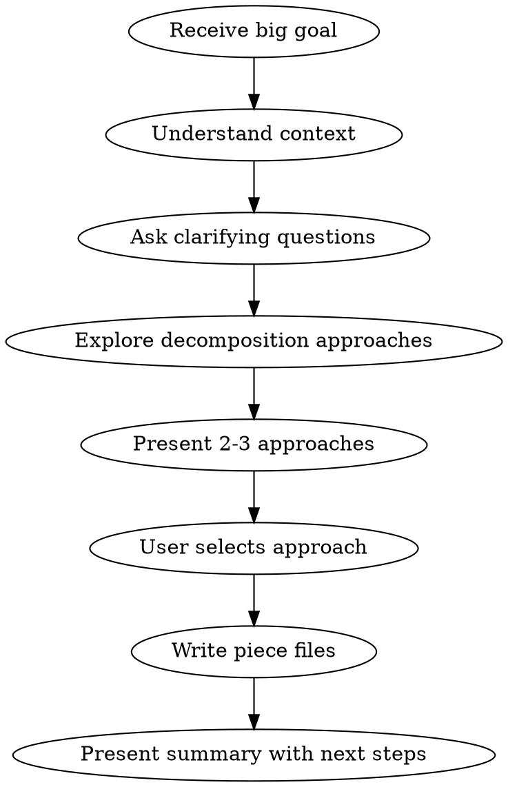

# Strategic Decomposition

## Overview

Break big goals (milestones, epics, products) into feature-sized pieces. Each piece becomes input for a separate vrau:start workflow.

**Output WHAT to build, not HOW.** Save implementation details for the brainstorm phase of each piece.

## When to Use

Use this skill when the goal is **larger than a single feature**:
- Milestones with multiple user-facing capabilities
- Epics spanning multiple components
- Product initiatives requiring phased delivery
- Any goal that would take more than 2-3 weeks of focused work

## When NOT to Use

**Skip decomposition and go directly to vrau:start when:**
- Goal fits in a single brainstorm session (one feature, one component)
- You can describe the entire scope in 2-3 sentences
- There are no meaningful sub-parts to parallelize
- The work would result in only 1-2 pieces anyway

**Signs you're over-decomposing:**
- Pieces feel like implementation steps, not independent features
- You're creating pieces just to have more pieces
- Each piece wouldn't make sense as a standalone vrau workflow

**When in doubt:** Try vrau:start first. If brainstorming reveals the scope is too large, then come back and decompose.

## The Process



### 1. Understand Context First

Before decomposing, understand:
- What exists today? (current state)
- What's the vision? (end state)
- Who is this for? (audience)
- What are the hard constraints? (time, tech, resources)

Read relevant files, docs, recent commits. Don't assume.

### 2. Ask Clarifying Questions

One question at a time. Must clarify:
- MVP vs full vision - what's the minimum viable milestone?
- Timeline pressure - is this a sprint or a quarter?
- Dependencies - are there external blockers?

### 3. Explore Decomposition Approaches

Always present **2-3 different ways** to slice the milestone:

| Approach | Description | Pieces | Trade-off |
|----------|-------------|--------|-----------|
| MVP-first | Minimal viable, then enhance | 3-4 | Fast value, may refactor |
| Layer-by-layer | Foundation → Core → Polish | 5-7 | Clean architecture, slower value |
| User-journey | Slice by user workflow | 4-6 | User-focused, may have deps |

Lead with your recommendation and why.

### 4. Write Piece Files

Target **3-7 pieces**. More than 7 = probably wrong granularity.

Write to: `docs/decomposition/YYYY-MM-DD-<milestone-name>/`

**File naming:** `<descriptive-name>.md` (NOT numbered: 01-*, 02-*)

Each file MUST include:

```markdown
# <Piece Title>

## Milestone Context
<Copy the overall milestone goal here - makes file standalone>

## This Piece
<2-3 sentence description of WHAT this piece delivers>

## Goals
- <User-visible outcome 1>
- <User-visible outcome 2>

## Constraints
- <Hard constraint 1>
- <Hard constraint 2>

## Dependencies
- Blocked by: <piece-name> (if any)
- Blocks: <piece-name> (if any)
- Can parallelize with: <piece-name> (if any)

## Out of Scope
<What this piece explicitly does NOT include>
```

### 5. Summary Document

Create `_overview.md` with:
- Milestone goal
- Chosen approach and why
- Dependency graph (text or mermaid)
- Suggested order (but pieces should be independently startable)
- Definition of done for the milestone

## What NOT to Include

**These belong in vrau:brainstorm, not here:**
- API designs or code examples
- Acceptance criteria with checkboxes
- Technical implementation details
- Specific libraries or tools
- Data models or schemas

**If you're writing code or APIs, STOP. You're doing brainstorming, not decomposition.**

## Red Flags

| You're doing this | Do this instead |
|-------------------|-----------------|
| Writing API examples | Delete them. Just describe the goal. |
| More than 7 pieces | Combine related pieces or split milestone |
| Numbered filenames (01-*) | Use descriptive names |
| Skipping clarifying questions | Ask about MVP, timeline, constraints |
| Single decomposition approach | Present 2-3 options |
| Pieces reference each other by number | Use piece names, include milestone context |

## After Decomposition

Present the pieces and ask:
```
Ready to start the first piece?
→ Run vrau:start with <recommended-first-piece>
```

User will run vrau:start multiple times, once per piece.
