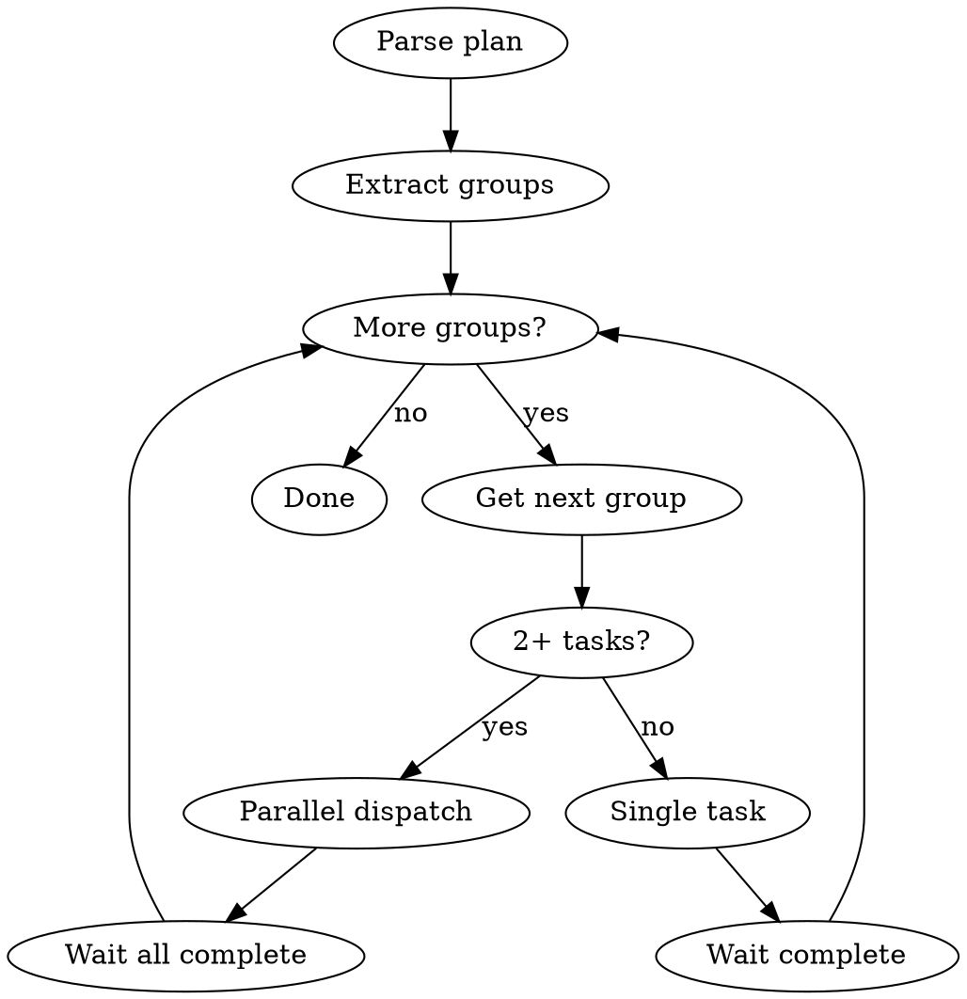

# Vrau Executing Plans

Execute plans with automatic parallel dispatch based on dependency graph.

## ⚠️ MANDATORY CODE REVIEW REQUIREMENT ⚠️

**AFTER EVERY PARALLEL GROUP, YOU MUST:**
1. **Invoke `superpowers:requesting-code-review` skill** - NO EXCEPTIONS
2. **The skill spawns a FRESH EYES reviewer** - separate agent, unbiased
3. **Uses SONNET model** - for quality review
4. **DO NOT skip** - Code review is MANDATORY, not optional
5. **DO NOT review yourself** - You are biased, must use fresh reviewer

**If you skip this step, you have FAILED the task.**

---

## Overview

Reads plan's parallel execution groups and dispatches concurrent agents for independent tasks.

**Core principle:** Parse dependency graph → Execute groups in order → Parallel dispatch within groups → **INVOKE superpowers:requesting-code-review skill after each group (MANDATORY)**

---

## Status Logging (REQUIRED)

**The orchestrator MUST print status updates to the user.** This provides visibility into what's happening.

**Print BEFORE dispatching each task:**
```
▶ Starting Task N: <task name> (model: <model>)
```

**Print AFTER task completes:**
```
✓ Completed Task N: <task name>
```

**Print ALL superpowers skill phases:**

```
test-driven-development:
  → TDD: RED - writing failing tests
  → TDD: RED - verified tests fail
  → TDD: GREEN - writing minimal code
  → TDD: GREEN - tests passing
  → TDD: REFACTOR - cleaning up
  → TDD: complete

systematic-debugging:
  → DEBUG: Phase 1 - root cause investigation
  → DEBUG: Phase 2 - pattern analysis
  → DEBUG: Phase 3 - hypothesis testing
  → DEBUG: Phase 4 - implementing fix
  → DEBUG: verifying fix
  → DEBUG: complete

brainstorming:
  → BRAINSTORM: exploring user intent
  → BRAINSTORM: gathering requirements
  → BRAINSTORM: identifying constraints
  → BRAINSTORM: generating options
  → BRAINSTORM: evaluating trade-offs
  → BRAINSTORM: finalizing design
  → BRAINSTORM: complete

verification-before-completion:
  → VERIFY: running tests
  → VERIFY: checking build
  → VERIFY: confirming output matches expected
  → VERIFY: evidence gathered
  → VERIFY: complete

writing-plans:
  → PLAN: analyzing requirements
  → PLAN: identifying tasks
  → PLAN: defining file paths
  → PLAN: writing code samples
  → PLAN: complete

requesting-code-review:
  → CODE-REVIEW: dispatching reviewer
  → CODE-REVIEW: waiting for feedback
  → CODE-REVIEW: feedback received

receiving-code-review:
  → REVIEW-RESPONSE: evaluating feedback
  → REVIEW-RESPONSE: verifying claims
  → REVIEW-RESPONSE: implementing valid changes
  → REVIEW-RESPONSE: documenting disagreements
  → REVIEW-RESPONSE: complete

using-git-worktrees:
  → WORKTREE: selecting directory
  → WORKTREE: creating worktree
  → WORKTREE: verifying isolation
  → WORKTREE: running setup commands
  → WORKTREE: complete

finishing-a-development-branch:
  → FINISH: verifying tests pass
  → FINISH: presenting options (merge/PR/keep/discard)
  → FINISH: executing choice
  → FINISH: cleanup complete

dispatching-parallel-agents:
  → PARALLEL: identifying independent tasks
  → PARALLEL: dispatching N agents
  → PARALLEL: waiting for completion
  → PARALLEL: all agents complete

subagent-driven-development:
  → SUBAGENT: dispatching task agent
  → SUBAGENT: task complete
  → SUBAGENT: spec compliance review
  → SUBAGENT: code quality review
  → SUBAGENT: reviews passed

executing-plans:
  → EXECUTE: loading plan
  → EXECUTE: reviewing plan critically
  → EXECUTE: starting batch N
  → EXECUTE: batch N complete
  → EXECUTE: awaiting architect review
  → EXECUTE: all batches complete
```

**Print group transitions:**
```
═══ Group A complete (Tasks 0, 1) ═══
═══ Starting Group B (Tasks 2, 3) ═══
```

**Why:** Without status logging, the user has no visibility into execution progress. Silent execution feels broken.

---

## CRITICAL: Subagent Skill Preamble

**Every task prompt MUST include this preamble:**

```
BEFORE doing ANY work, you MUST check for applicable superpowers skills:

- Writing code/tests → Invoke superpowers:test-driven-development FIRST
- Debugging/fixing → Invoke superpowers:systematic-debugging FIRST
- Design decisions → Invoke superpowers:brainstorming FIRST

This is NOT optional. "Task didn't mention TDD" is not an excuse.
"This is simple" is not an excuse. Invoke the skill FIRST.

If you find yourself writing implementation code without having
invoked test-driven-development, STOP. You are violating discipline.

STATUS REPORTING: You MUST print status updates for EVERY superpowers skill phase.

Format: "→ SKILL: phase description"

Examples:
  → TDD: RED - writing failing tests
  → TDD: GREEN - tests passing
  → DEBUG: Phase 1 - root cause investigation
  → BRAINSTORM: gathering requirements
  → VERIFY: running tests
  → CODE-REVIEW: dispatching reviewer
  → SUBAGENT: spec compliance review
  → WORKTREE: creating worktree
  → FINISH: verifying tests pass

Print these as you enter each phase. The user must see superpowers working.
```

**Why:** Subagents have no memory of quality expectations. Without this preamble, they skip TDD (baseline test showed agents write code first, tests second).

---

## Execution Flow



## Step 1: Parse Plan

Extract from plan:
1. **Parallel Execution Groups table**
2. **Model Assignments table**
3. **Full task content**

## Step 2: Execute by Group

### Single Task in Group

```
Task tool:
  subagent_type: "general-purpose"
  model: <from plan>
  prompt: "[SKILL PREAMBLE from above]

TASK:
<task content from plan>"
```

### Multiple Tasks in Group (2+)

**REQUIRED:** Use `superpowers:dispatching-parallel-agents`

Dispatch ALL tasks in single message, each with skill preamble:

```
Task tool (call 1):
  subagent_type: "general-purpose"
  model: <from plan>
  prompt: "[SKILL PREAMBLE]

TASK:
<Task 1 content>"

Task tool (call 2):
  subagent_type: "general-purpose"
  model: <from plan>
  prompt: "[SKILL PREAMBLE]

TASK:
<Task 2 content>"
```

**Wait for ALL to complete before next group.**

**IMMEDIATELY AFTER group completes:** Go to "Between Groups" section for MANDATORY code review.

## Model Enforcement

| Plan says | Task tool parameter |
|-----------|---------------------|
| haiku | `model: "haiku"` |
| sonnet | `model: "sonnet"` |
| opus | `model: "opus"` |

## Conflict Check

Before parallel dispatch, verify:
- Tasks don't edit same files
- No hidden dependencies
- Truly independent

If conflict detected → execute sequentially.

## Between Groups

**CRITICAL: CODE REVIEW IS MANDATORY. NO EXCEPTIONS.**

**DO NOT skip this step. DO NOT proceed without code review. DO NOT rationalize why it's not needed.**

1. Verify all tasks succeeded
2. Check for change conflicts
3. **MANDATORY: Request code review after EACH parallel group:**

   **BEFORE doing ANYTHING else, announce to user:**
   > "Using **superpowers:requesting-code-review** to spawn a FRESH EYES reviewer (sonnet model) for group [X] implementation."

   **Then invoke the skill - it will spawn a SEPARATE agent with FRESH EYES:**
   ```
   Skill tool:
   - skill: "superpowers:requesting-code-review"
   ```

   **CRITICAL: The skill MUST spawn a FRESH, UNBIASED reviewer agent:**
   - Uses **sonnet model** for review
   - Spawns a SEPARATE agent with NO prior context
   - Fresh eyes catch issues you would miss
   - DO NOT review yourself - you are biased

   **Wait for review completion. The fresh reviewer will:**
   - Review code against requirements
   - Check coding standards
   - Verify implementation quality
   - Provide unbiased feedback

   **If review identifies issues:**
   - Fix ALL issues immediately
   - Re-invoke superpowers:requesting-code-review (spawns fresh reviewer again)
   - DO NOT proceed until review passes

4. **Update execution log:**
   - Update Current Group to next group letter
   - Add completed task numbers to Completed Tasks
   - Note review results: "Code review PASSED for group [X]"
   - Commit and push
5. Proceed to next group

**STOP if you think any of these:**
- "Code review is optional" → NO. It's MANDATORY.
- "I'll skip it this time" → NO. NEVER skip.
- "Tasks are simple, don't need review" → NO. ALL tasks need review.
- "I'll review manually instead" → NO. Use the skill with FRESH EYES.
- "I can review it myself" → NO. You're biased. Spawn fresh reviewer.
- "Review after next group" → NO. Review NOW.
- "Don't need separate agent" → NO. MUST spawn fresh, unbiased reviewer.

## Red Flags

**CRITICAL VIOLATIONS - NEVER DO THESE:**

- **Skip code review** → MANDATORY after EVERY group, NO EXCEPTIONS
- **Proceed to next group without code review** → STOP. Review first.
- **Review code yourself instead of using superpowers:requesting-code-review** → NO. MUST use fresh eyes.
- **Think "review is optional"** → NO. It's MANDATORY.
- **Think "tasks are simple, don't need review"** → NO. ALL tasks need review.
- **Think "I can review my own code"** → NO. Biased. Use fresh reviewer.
- Skip model enforcement
- Dispatch parallel tasks editing same files
- Proceed before group completes
- Ignore task failures
- Dispatch tasks WITHOUT the skill preamble
- Skip TDD because "task is simple"

## Subagent Skill Violations

If you observe subagents doing any of these, they ignored the preamble:

| Violation | What Happened | Fix |
|-----------|---------------|-----|
| Code before tests | Agent wrote implementation first | Preamble was ignored or missing |
| No skill invocation | Agent didn't invoke superpowers:* | Re-dispatch with preamble |
| "This is simple" | Agent skipped TDD for "simple" task | No exceptions - always TDD |
| Tests written with code | Tests and code written together | TDD = tests FIRST, not together |

## Integration

- `superpowers:dispatching-parallel-agents` - parallel dispatch
- `superpowers:subagent-driven-development` - single-task execution
- `superpowers:finishing-a-development-branch` - after all complete
