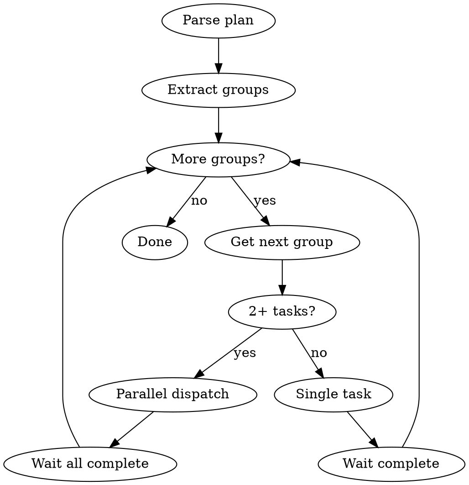

# Vrau Executing Plans

Execute plans with automatic parallel dispatch based on dependency graph.

## Overview

Reads plan's parallel execution groups and dispatches concurrent agents for independent tasks.

**Core principle:** Parse dependency graph → Execute groups in order → Parallel dispatch within groups

---

## CRITICAL: Subagent Skill Preamble

**Every task prompt MUST include this preamble:**

```
BEFORE doing ANY work, you MUST check for applicable superpowers skills:

- Writing code/tests → Invoke superpowers:test-driven-development FIRST
- Debugging/fixing → Invoke superpowers:systematic-debugging FIRST
- Design decisions → Invoke superpowers:brainstorming FIRST

This is NOT optional. "Task didn't mention TDD" is not an excuse.
"This is simple" is not an excuse. Invoke the skill FIRST.

If you find yourself writing implementation code without having
invoked test-driven-development, STOP. You are violating discipline.
```

**Why:** Subagents have no memory of quality expectations. Without this preamble, they skip TDD (baseline test showed agents write code first, tests second).

---

## Execution Flow



## Step 1: Parse Plan

Extract from plan:
1. **Parallel Execution Groups table**
2. **Model Assignments table**
3. **Full task content**

## Step 2: Execute by Group

### Single Task in Group

```
Task tool:
  subagent_type: "general-purpose"
  model: <from plan>
  prompt: "[SKILL PREAMBLE from above]

TASK:
<task content from plan>"
```

### Multiple Tasks in Group (2+)

**REQUIRED:** Use `superpowers:dispatching-parallel-agents`

Dispatch ALL tasks in single message, each with skill preamble:

```
Task tool (call 1):
  subagent_type: "general-purpose"
  model: <from plan>
  prompt: "[SKILL PREAMBLE]

TASK:
<Task 1 content>"

Task tool (call 2):
  subagent_type: "general-purpose"
  model: <from plan>
  prompt: "[SKILL PREAMBLE]

TASK:
<Task 2 content>"
```

**Wait for ALL to complete before next group.**

## Model Enforcement

| Plan says | Task tool parameter |
|-----------|---------------------|
| haiku | `model: "haiku"` |
| sonnet | `model: "sonnet"` |
| opus | `model: "opus"` |

## Conflict Check

Before parallel dispatch, verify:
- Tasks don't edit same files
- No hidden dependencies
- Truly independent

If conflict detected → execute sequentially.

## Between Groups

1. Verify all tasks succeeded
2. Check for change conflicts
3. Run tests if applicable
4. **Update execution log:**
   - Update Current Group to next group letter
   - Add completed task numbers to Completed Tasks
   - Note any issues in Notes
   - Commit and push
5. Proceed to next group

## Red Flags

**Never:**
- Skip model enforcement
- Dispatch parallel tasks editing same files
- Proceed before group completes
- Ignore task failures
- **Dispatch tasks WITHOUT the skill preamble**
- **Skip TDD because "task is simple"**

## Subagent Skill Violations

If you observe subagents doing any of these, they ignored the preamble:

| Violation | What Happened | Fix |
|-----------|---------------|-----|
| Code before tests | Agent wrote implementation first | Preamble was ignored or missing |
| No skill invocation | Agent didn't invoke superpowers:* | Re-dispatch with preamble |
| "This is simple" | Agent skipped TDD for "simple" task | No exceptions - always TDD |
| Tests written with code | Tests and code written together | TDD = tests FIRST, not together |

## Integration

- `superpowers:dispatching-parallel-agents` - parallel dispatch
- `superpowers:subagent-driven-development` - single-task execution
- `superpowers:finishing-a-development-branch` - after all complete
