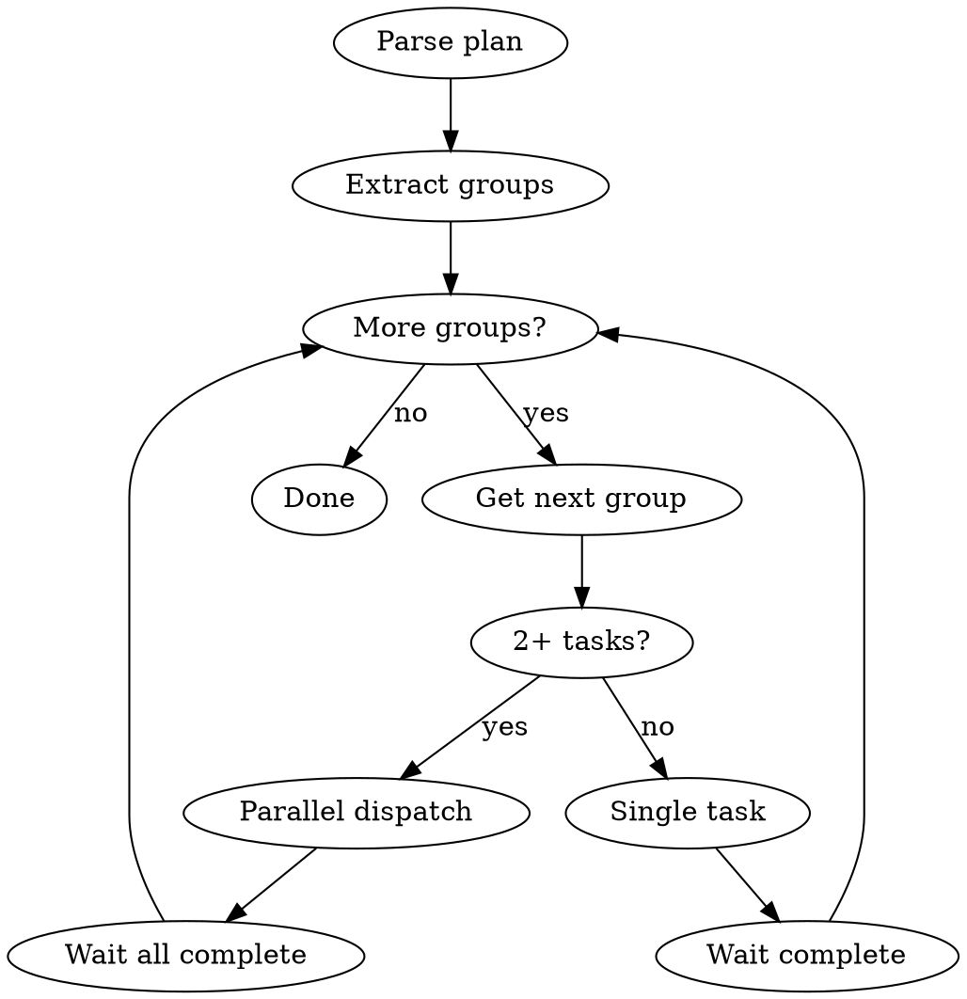

# Vrau Executing Plans

Execute plans with automatic parallel dispatch based on dependency graph.

## Overview

Reads plan's parallel execution groups and dispatches concurrent agents for independent tasks.

**Core principle:** Parse dependency graph → Execute groups in order → Parallel dispatch within groups

## Execution Flow



## Step 1: Parse Plan

Extract from plan:
1. **Parallel Execution Groups table**
2. **Model Assignments table**
3. **Full task content**

## Step 2: Execute by Group

### Single Task in Group

Use `superpowers:subagent-driven-development`:

```
Task tool:
  subagent_type: "general-purpose"
  model: <from plan>
  prompt: <task content>
```

### Multiple Tasks in Group (2+)

**REQUIRED:** Use `superpowers:dispatching-parallel-agents`

Dispatch ALL tasks in single message:

```
Task tool (call 1):
  subagent_type: "general-purpose"
  model: <from plan>
  prompt: "Task 1: ..."

Task tool (call 2):
  subagent_type: "general-purpose"
  model: <from plan>
  prompt: "Task 2: ..."
```

**Wait for ALL to complete before next group.**

## Model Enforcement

| Plan says | Task tool parameter |
|-----------|---------------------|
| haiku | `model: "haiku"` |
| sonnet | `model: "sonnet"` |
| opus | `model: "opus"` |

## Conflict Check

Before parallel dispatch, verify:
- Tasks don't edit same files
- No hidden dependencies
- Truly independent

If conflict detected → execute sequentially.

## Between Groups

1. Verify all tasks succeeded
2. Check for change conflicts
3. Run tests if applicable
4. Proceed to next group

## Red Flags

**Never:**
- Skip model enforcement
- Dispatch parallel tasks editing same files
- Proceed before group completes
- Ignore task failures

## Integration

- `superpowers:dispatching-parallel-agents` - parallel dispatch
- `superpowers:subagent-driven-development` - single-task execution
- `superpowers:finishing-a-development-branch` - after all complete
